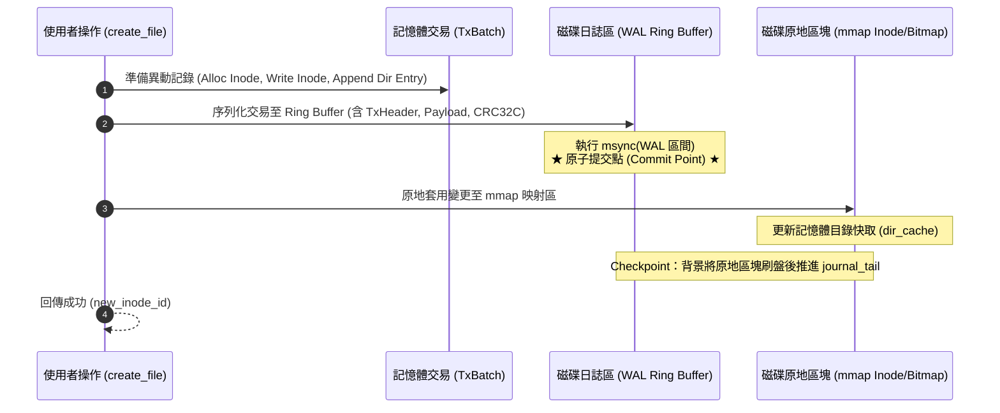

# OIFS Metadata WAL (Write-Ahead Logging / Journaling) 規格設計書

本文件定義 **OIFS (O's Inode File System)** 的 **Metadata WAL (Write-Ahead Logging / 日誌子系統)** 架構規範、日誌格式、磁碟佈局、崩潰復原機制與形式化驗證設計。

---

## 1. 背景與痛點 (Problem Statement)

目前 OIFS 在執行多項元數據異動時（例如 `create_file`、`delete_file`、`mkdir`），需要相繼修改多個互不相鄰的磁碟區塊：
1. **Inode Bitmap** 標記已分配/釋放
2. **Data Block Bitmap** 標記資料區塊已分配/釋放
3. **Inode Table** 寫入或更新 Inode 結構（256 位元組）
4. **目錄資料區塊** 追加或移除 `DirectoryEntry`
5. **父目錄 Inode** 更新檔案大小與 `modified_at` 時間戳記

### 當前風險
若在上述連續寫入的途中遭遇 **斷電、行程 SIGKILL 崩潰或主機重開機**：
* 容易產生孤立 Inode (Orphan Inodes)、洩漏區塊 (Leaked Blocks) 或目錄項指向無效 Inode 的情況。
* 目前系統必須仰賴全盤掃描的 `oifs fsck` 來重新走訪所有 Inode 與區塊進行修復，對於大型映像檔耗時較長。

### 目標 (Goals)
* **可選功能 (Opt-in / Optional Feature)**：支援使用者在建立映像檔時自由選擇是否啟用日誌（`--journal`）。未啟用時維持極致輕量與零額外磁碟開銷。
* **原子事務 (Atomic Transactions)**：啟用日誌時，確保一組元數據修改具備「All-or-Nothing」原子性。
* **毫秒級復原 (Fast Crash Recovery)**：開機載入時透過循序重放日誌（Redo Replay），於 **< 5ms** 內自動修復未完成事務，無需全盤 `fsck`。
* **零拷貝與 4KB 對齊不受影響**：WAL 僅記錄 Metadata 操作，不干擾資料區塊的 4096-byte 頁面對齊與零拷貝讀寫。
* **100% 向下相容性**：既有舊版映像檔或未啟用日誌的檔案系統可無縫掛載與運作，讀寫路徑零額外負擔。

---

## 2. 可選架構設計與向下相容 (Optional Architecture & Compatibility)

WAL 機制被設計為**完全可選的模組化外掛（Opt-in Feature）**，類似 Linux ext2（無日誌）與 ext3/ext4（有日誌 JBD2）的關係：

### 2.1 CLI 建立介面
* **啟用日誌（預設推薦用於需要高可靠性的環境）**：
  ```bash
  cargo run --bin oifs -- -i disk.img create --size 10 --journal
  ```
* **停用日誌（純極限記憶體吞吐量或極小尺寸映像檔）**：
  ```bash
  cargo run --bin oifs -- -i disk.img create --size 10 --no-journal
  ```

### 2.2 磁碟佈局雙模對比

#### 模式 A：停用日誌（Legacy / No-Journal，與目前 OIFS 100% 相同）
```text
[Block 0] SuperBlock (has_journal = false, journal_block_count = 0)
[Block 1] Inode Bitmap
[Block 2] Data Bitmap
[Block 3 .. 1026] Inode Table (1024 區塊)
[Block 1027 ..] Data Blocks (實際資料)
```
* 特色：無任何空間浪費，讀寫行為與既有程式碼完全一致。

#### 模式 B：啟用日誌（Journaled）
```text
[Block 0] SuperBlock (has_journal = true, journal_block_count = 32)
[Block 1] Inode Bitmap
[Block 2] Data Bitmap
[Block 3 .. 34] Journal Ring Buffer (32 個區塊 = 128 KB)
[Block 35 .. 1058] Inode Table (1024 區塊)
[Block 1059 ..] Data Blocks (實際資料)
```

### 2.3 執行期雙軌分支（Zero-Overhead Dispatch）
在 `DiskManager` 的寫入關鍵路徑中，依據 `guard.has_journal()` 決定策略：
```rust
if guard.has_journal() {
    // 啟用模式：先寫入 WAL 交易 -> msync WAL -> 套用至記憶體 -> 背景 Checkpoint
    Self::execute_metadata_transaction(&mut guard, tx)?;
} else {
    // 停用模式：維持現有原地更新與 sync_mutation_ranges (零額外開銷)
    Self::execute_legacy_in_place(&mut guard, mutation)?;
}
```

---

## 3. 磁碟佈局與結構 (Disk Layout)

WAL 日誌區塊採用**專屬固定大小環狀緩衝區 (Circular Ring Buffer)** 結構：

```text
+---------------+-------------------+------------------+-----------------------+---------------------+-------------------+
| Block 0       | Block 1           | Block 2          | Block 3 .. 34         | Block 35 .. 1058    | Block 1059 ..     |
| SuperBlock    | Inode Bitmap      | Data Bitmap      | Journal Ring Buffer   | Inode Table         | Data Blocks       |
| (含 WAL 參數) | (1 block = 32K)   | (1 block = 32K)  | (32 blocks = 128KB)   | (1024 blocks)       | (實際檔案/目錄)   |
+---------------+-------------------+------------------+-----------------------+---------------------+-------------------+
```

### 2.1 SuperBlock 欄位擴充
在 [`src/superblock.rs`](file:///Users/ych/oifs/src/superblock.rs) 的 `SuperBlock` 結構中擴充以下欄位（利用 Block 0 剩餘空間，保持向下相容）：

```rust
pub struct SuperBlock {
    // ... 既有欄位 (magic, block_size, block_count 等) ...

    // --- Metadata WAL 擴充欄位 ---
    /// 是否啟用 WAL 日誌功能
    pub has_journal: bool,
    /// 日誌區塊起始 Block ID (例如 3)
    pub journal_start_block: u64,
    /// 日誌區塊總數 (例如 32，共 128 KB)
    pub journal_block_count: u32,
    /// 日誌寫入指標 (Head Byte Offset 於日誌環狀區內)
    pub journal_head: u64,
    /// 日誌 Checkpoint 推進指標 (Tail Byte Offset)
    pub journal_tail: u64,
    /// 單調遞增交易 Sequence ID
    pub journal_tx_seq: u64,
    /// 乾淨卸載標記 (Cleanly Unmounted Flag)
    pub cleanly_unmounted: bool,
}
```

---

## 3. 日誌交易與記錄格式 (WAL Record & Transaction Format)

每個事務由一個固定大小的標頭（Header）、多個原子操作記錄（Operations）及結尾標記組成，並以硬體加速的 **CRC32C** 校驗整筆交易，防止撕裂寫入（Torn Write）。

### 3.1 交易結構 (Transaction Frame)

```text
+-----------------------------------------------------------------------------------+
| TxHeader (24 Bytes)                                                               |
|  - magic: u32 = 0x57414C54 ("WALT")                                              |
|  - tx_seq: u64 (遞增事務編號)                                                      |
|  - payload_len: u32 (Records 資料總長度)                                          |
|  - crc32c: u32 (涵蓋整個 Header 與 Payload 的校驗碼)                              |
|  - reserved: u32                                                                  |
+-----------------------------------------------------------------------------------+
| Payload: 一連串緊湊序列化的 MetadataOp Records                                    |
|  - Op 1: SetInodeBitmap { inode_id, allocated }                                   |
|  - Op 2: WriteInode { inode_id, inode_data }                                      |
|  - Op 3: MutateDirectoryBlock { block_id, offset, bytes }                         |
|  - Op 4: UpdateInode { inode_id, size, mtime }                                    |
+-----------------------------------------------------------------------------------+
| TxCommitMarker: u32 = 0xDEADBEEF                                                  |
+-----------------------------------------------------------------------------------+
```

### 3.2 操作類型定義 (MetadataOp)

```rust
#[derive(Debug, Clone, Serialize, Deserialize, PartialEq)]
pub enum MetadataOp {
    /// Inode Bitmap 分配或釋放
    SetInodeBitmap {
        inode_id: u64,
        allocated: bool,
    },
    /// Data Block Bitmap 分配或釋放
    SetDataBitmap {
        block_id: u64,
        allocated: bool,
    },
    /// Inode 寫入或原地屬性更新
    WriteInode {
        inode_id: u64,
        inode_bytes: [u8; 256],
    },
    /// 目錄資料區塊的局部寫入 (新增/刪除 entry)
    WriteDirectorySlice {
        block_id: u64,
        offset: u16,
        data: Vec<u8>,
    },
}
```

---

## 4. 寫入管線生命週期 (Write Pipeline & Lifecycle)

以建立檔案 `create_file(parent_id, "example.txt")` 為例，變更流程重構為 4 個標準階段：



### 關鍵原子保證
1. **斷電發生在步驟 2 之前**：WAL 無此記錄，主資料未被修改，狀態保持原子乾淨。
2. **斷電發生在步驟 2 之中（Torn Write）**：CRC32C 校驗失敗，開機時直接捨棄該筆無效交易，狀態等同未發生。
3. **斷電發生在步驟 3 途中（原地修改做到一半）**：WAL 已經具有完整的 CRC32C，開機復原時重新套用（Redo），自動修補未完成的 Inode 或 Bitmap。

---

## 5. 崩潰復原機制 (Crash Recovery & Redo Replay)

在 `DiskManager::open` 初始化階段，若偵測到 `cleanly_unmounted == false` 或 `journal_head != journal_tail`：

```rust
pub fn recover_from_journal(mmap: &mut MmapMut, sb: &mut SuperBlock) -> Result<usize, DiskManagerError> {
    let mut cursor = sb.journal_tail;
    let mut replayed_transactions = 0;
    let ring_size = sb.journal_block_count as u64 * sb.block_size as u64;

    while cursor != sb.journal_head {
        match read_tx_frame(mmap, sb, cursor) {
            Ok(tx) if tx.verify_crc() => {
                // CRC 吻合：交易有效，重放所有操作
                for op in tx.ops {
                    apply_op_in_place(mmap, sb, &op)?;
                }
                cursor = (cursor + tx.total_len()) % ring_size;
                replayed_transactions += 1;
            }
            _ => {
                // 遇到損毀、不完整或未提交交易：終止重放
                break;
            }
        }
    }

    // 將所有套用變更同步回磁碟，重置日誌指標
    mmap.flush()?;
    sb.journal_tail = cursor;
    sb.journal_head = cursor;
    sb.cleanly_unmounted = true;
    sync_superblock(mmap, sb)?;

    Ok(replayed_transactions)
}
```

---

## 6. 與現有特性的協同設計

1. **DurabilityMode 取捨**：
   - `DurabilityMode::Strict`：每次交易寫入 WAL 後皆同步 `msync` WAL 區段（零遺失保證）。
   - `DurabilityMode::Lazy` / `RangeAsync`：記憶體中批次緩衝日誌，依週期性 Timer 或明確 `sync()` 時落盤（兼顧極限吞吐量）。
2. **Master-Proxy IPC**：
   - 僅由 Master 行程負責寫入 WAL 與推進指標，Proxy 行程透過 UDS/TCP 發送請求，無跨行程日誌鎖爭用問題。
3. **形式化驗證 (Kani Proofs)**：
   - 證明 `apply_op_in_place` 具備**嚴格冪等性**（重複執行兩次結果完全相同）。
   - 證明環狀指標偏移計算 `(cursor + len) % ring_size` 絕不發生整數溢位或越界。

---

## 7. 推進里程碑 (Roadmap)

| 階段 | 項目 | 目標 | 狀態 |
| :--- | :--- | :--- | :--- |
| **M1** | 格式與日誌模組 (`src/journal.rs`) | 實作 `MetadataOp` 序列化、TxHeader 與 CRC32C 計算 | ✅ **完成** |
| **M2** | Superblock 擴充與佈局更新 | 支援建立帶有日誌區塊的映像檔，並保持向下相容解析 | ✅ **完成** |
| **M3** | 寫入路徑重構 (`src/disk.rs`) | 將 `create_file`、`delete_file`、`mkdir` 納入日誌交易 | ✅ **完成** |
| **M4** | 崩潰復原與壓力測試 | 模擬斷電崩潰（Kill process / Torn-write injection）驗證自動自癒 | ✅ **完成** |
| **M5** | Kani 形式化證明 | 加入 CBMC 形式化數學驗證，證明重放安全性與環狀緩衝不變量 | ✅ **完成** |

---

## 8. 實作成果 (Implementation Status)

### 8.1 已完成：M1 格式與日誌模組 (`src/journal.rs`)

* **CRC32C (Castagnoli)**：以 `const fn` 產生 256 項查找表，不依賴 `crc32c` crate，因此可在 Kani/CBMC 下驗證；輸出符合標準檢查值 `0xE3069283`。
* **交易框架**：`magic(4) tx_seq(8) payload_len(4) crc32c(4) payload commit(4)`。CRC 明確涵蓋 `tx_seq || payload_len || payload`（即撕裂寫入可能破壞的區域），編碼器與解碼器共用同一個 `crc_input()` 函式以杜絕兩端不一致。
* **`MetadataOp` 四種冪等操作**：`SetInodeBitmap`、`SetDataBitmap`、`WriteInode`、`WriteBlockSlice`。全部為「絕對後映像寫入」，不使用增量或相對位移，因此**重放任意次數與重放一次等價**。
* **`JournalRing` 環狀緩衝**：1 個標頭區塊 + 32 個記錄區塊（128 KB）。框架永不被環狀邊界切開；容量不足時推進 tail（覆蓋最舊交易），此舉安全之處正在於重放的冪等性。
* **`recover()`**：自 tail 走訪至 head，逐筆驗證 CRC 與 commit marker，遇損毀框架即停止（其前皆為有效資料），並回傳重放筆數。

### 8.2 已完成：M2 佈局與向下相容

* **完全不修改 `SuperBlock` 結構體**。日誌參數改以一個自帶 magic 的標頭區塊存放在 Block 3，其餘欄位的 bincode 位元組序列與舊版**完全一致**。
* `SuperBlock::new_with_layout(total_blocks, inode_table_block)` 抽出共用公式；`new()` 等同 `new_with_layout(nb, 3)`（已由 Kani 證明兩者結���相等），因此**未啟用日誌的映像檔佈局與舊版逐位元組相同**。
* `SuperBlock::new_journaled()` 將 inode table 置於 `3 + 33 = 36`，`has_journal_layout()` 即以此幾何條件偵測。
* **CLI**：`oifs -i disk.img create --size 10 --journal`。
* **自動復原**：日誌於掛載時、在 manager 對外發布「之前」完成重放，因此呼叫者不可能觀察到半復原的檔案系統。Proxy 行程不需傳遞任何旗標。

### 8.3 已驗證

* **單元測試 12 項**（`src/journal.rs`）：CRC 向量、狀態往返、op 編解碼往返、框架往返、**逐一翻轉每個位元驗證皆被 CRC 拒絕**、環狀回捲不切開框架、`recover` 於撕裂框架處停止、`apply_op_in_place` **冪等性**。
* **整合測試 11 項**（`tests/journal_test.rs`）：建立/重開/CRUD 往返、舊版映像檔不受影響、Block 3 標頭驗證、**崩潰復原重放**（寫入 durable tx 但不套用，掛載後驗證 bit 已設置）、**撕裂交易被捨棄且檔案系統仍可用**、redo 冪等性。
* **Kani 證明 53 項全數通過**（新增 3 項）：`proof_legacy_layout_unchanged`、`proof_journaled_layout_non_overlapping`、`proof_journaled_shifts_data_start`。
* 全數 45 個測試套件、clippy（`-D warnings`）、fmt 皆通過，無回歸。

### 8.4 已完成：M3 寫入路徑整合（`delete_file`）

`delete_file` 已改為 WAL-first，並以 `has_journal_layout()` 分流，**未啟用日誌的映像檔完全走原路徑，零額外開銷**。

**三階段實作**（`delete_file_journaled`）：

1. **Compute（不變更映像檔）**：定位 entry → 序列化成新的目錄區塊後映像 → 收集待釋放區塊清單 → 算出具 mtime 的父 inode 後映像。
2. **Commit（原子提交點）**：`commit_journal_tx` 將交易 append 至環狀緩衝，並 `msync` **框架位元組**與**推進 `head` 的標頭區塊**。兩者都必須刷盤且不可重新排序，否則復原時看不到交易。
3. **Apply**：`apply_journal_ops` 將同一組 op 套用回映像檔，接著同步 allocator hint 與 inode/dir cache。

**關鍵輔助函式**：

* `build_dir_block_image()` — 零填後依序序列化，與 `rewrite_dir_entries_in_block()` **逐位元組相同**，確保兩條路徑產生的區塊完全一致。
* `build_inode_post_image()` — `write_inode_internal()` 只覆寫 bincode 前綴、保留 slot 尾端舊位元組，因此後映像必須**從 slot 現有內容出發**而非從零開始。這個細節若忽略，復原會寫出與原路徑不同的 inode。
* `commit_journal_tx()` — 非日誌映像檔直接返回，確保零開銷。

### 8.5 M3 其餘部分：`create_file` / `mkdir` 已完成

`create_entry_journaled` 同時涵蓋檔案與目錄（兩者差別僅在於是否為新 inode 保留資料區塊）。

**最大難題：配置本身會修改 bitmap。** 配置器是「從 hint 起找第一個空位」，因此結果依賴當下 bitmap 內容，邊算邊改。

解法是 **`AllocSim`**：把兩個 bitmap 區塊複製到本地，對複本執行**完全相同**的配置器（相同 hint 處理、相同找空位規則），因此預測出的 id 就是真實配置器會給的 id。`sim_get_or_alloc_block` 進一步模擬 `get_or_alloc_block`，包含目錄超過 10 個區塊時所需的**單層間接指標區塊**，並將指標寫入記錄成 `WriteBlockSlice` op 而非直接改 mmap。

如此一來，整個操作得以在**不動映像檔**的前提下完整描述為後映像：新增 inode bitmap 位元、資料 bitmap 位元、指標區塊寫入、目錄區塊寫入、兩個 inode 後映像。

**關鍵約束**：後映像必須在映像檔**尚未被修改**時讀取。

### 8.6 Checkpoint 機制

`JournalRing::checkpoint()` 將 `tail := head`，使 `used()` 歸零、復原時不重放任何交易。

**安全性判準**：只有當 in-place 位元組已持久化後才能 checkpoint，否則會遺失「已提交但未套用」交易的唯一紀錄。因此：

* `Strict`：交易已 `msync`，每筆交易後立即 checkpoint。
* `Lazy` / `RangeAsync` / `LegacyWholeMmapAsync`：映像檔可能僅存在於 page cache，保留環狀緩衝，由掛載時復原重放。因為採覆蓋最舊策略，長時間運行的 Master 也不會無限膨脹。
* 非日誌映像檔為 no-op。

### 8.7 一個必須處理的交互作用：未日誌化的寫入路徑

`write_data` 目前**尚未**納入日誌。若此時環狀緩衝仍留有待重放交易，復原時會把**舊的後映像**覆蓋在之後的 in-place 寫入之上，造成無聲的資料回滾（實測：create 的空 inode 後映像會把後續 write 設定的 `size` 與 block 指標覆寫掉，重開後讀回空檔案）。

解法是 `prepare_non_journaled_mutation()`：任何未日誌化的 metadata 變更開始前先清空環狀緩衝。由於日誌化路徑在同一把寫入鎖下原子完成，此時所有已提交交易都已在 in-place 套用完畢，因此清除是安全的。待全部路徑日誌化後，此函式即可移除。

### 8.8 CLI `rm` 子命令

新增 `oifs -i <image> rm <path>`，含 `--recursive/-r` 與 `--json`：

* 拒絕刪除根目錄。
* 非空目錄需明確加 `-r`，否則報錯（避免誤刪資料）。
* `-r` 以深度優先逐層刪除子項，確保每個子節點在被刪除時確實存在。

### 8.10 已完成：M6 `write_data` 日誌化

先前 `write_data` 會先呼叫 `prepare_non_journaled_mutation()` 清空環狀緩衝作為繞過；現已全面日誌化，該 workaround 已移除。

**關鍵設計：payload 不進 journal，改用 ordered 語義。**

若把使用者資料也寫入 journal，WAL 流量會隨檔案大小暴增（一個 300KB 的檔案每次寫入就要 30 萬筆位元組進 128KB 的環狀緩衝）。因此：

1. **Stage** — 透過 `AllocSim` 配置，payload 直接寫入區塊，此時這些區塊的 bitmap 位元**仍是空的**。
2. **Flush payload** — 上述區塊落到穩定儲存。
3. **Commit** — metadata 交易（bitmap + inode + 間接指標）append 並 `msync`。這是原子提交點。
4. **Apply** — 在原地重播 metadata op。

順序正是安全性的來源：**metadata 只可能在它所參照的資料持久化之後才變得持久化**，因此復原永遠不會釋出一個尚未填入內容的區塊。若在此刻崩潰，留下的只是空閒區塊裡的垃圾——無害。

**縮容時必須同時清理指標。** 這是實測抓到的真實 bug：檔案縮小會讓間接指標區塊殘留指向已回收區塊的 pointer，造成 `fsck` 回報 `missing_blocks`（inode 有映射但 bitmap 標為空閒）。`prune_stale_pointers()` 會把越過新長度的指標項歸零，並把這些歸零一併納入同一筆交易。

**四種情形皆已涵蓋**，且大小計算刻意與 legacy 路徑逐位元組一致（啟用 journal 不得改變檔案系統語意）：

| 情形 | 處理 |
|------|------|
| offset 0 全量覆寫 | filter → compress → encrypt → 從 phys 0 寫入 |
| 壓縮檔 EOF append | 新的 Zstd frame 直接附加在實體尾端 |
| 壓縮檔其他寫入 | 解壓 → splice → 從 0 重寫 |
| raw append / 隨機寫入 | 直接寫入指定偏移 |

**已移除的 workaround**：`prepare_non_journaled_mutation()`。其教訓已寫入 `src/journal.rs` 模組說明——未來任何 metadata 變更路徑都必須同樣日誌化，否則會重現「復原把舊後映像蓋掉新資料」的無聲回滾。

### 8.11 累計驗證結果

* **整合測試 38 項**（`tests/journal_test.rs`）：mkdir、重複名稱拒絕、**3000 筆檔案的單層間接指標目錄成長**、journaled 與 legacy 的區塊消耗幾何一致性、checkpoint 捨棄數量與冪等性、Strict 模式即時回收環狀緩衝、四執行緒並行 create/delete 後 fsck CLEAN；以及 M6 新增的 9 項：每次寫入恰好一筆交易、40KB 跨間接區塊、壓縮縮容釋放區塊、**offset-0 局部寫入與 legacy 逐位元組一致**、壓縮檔 append、隨機偏移寫入、區塊帳目一致、刪除後無洩漏。
* **CLI 測試 10 項**（`tests/cli_rm_test.rs`）：legacy 與 journaled 映像檔刪除、遺失路徑失敗、拒絕根目錄、空目錄可刪、非空需 `-r`、巢狀遞迴刪除後 fsck CLEAN、JSON 輸出、`--journal` 旗標確認預留區塊、刪除後同名重建、刪除後其餘檔案仍可讀取。（這些測試在測試檔內以 mutex 序列化：每項會啟動多個真實 CLI 行程，其 session rendezvous 在測試並行下會非確定性競爭。）
* **格式遷移測試 10 項**（`tests/format_migration_test.rs`）：v1 映像檔可完整讀寫與重開、fsck CLEAN、v1 記錄不可被 v2 解碼器誤讀、遷移就地完成且冪等、**中斷遷移的游標讓混合格式映像檔仍可正確讀取**。
* **Kani 證明 59 項全數通過**，其中日誌相關 6 項：環狀游標永不越界、checkpoint 必使環狀緩衝歸零、**CRC32C 必能偵測任意單一位元翻轉**（GF(2) 線性）、CRC 輸入區域為純函式且編解碼器一致、框架長度溢位在讀取前被拒、區塊切片邊界在寫入前被檢查。
* 實機驗證：journaled 映像檔寫入 300KB 隨機資料後讀回**位元組完全一致**（`cmp` 驗證）；`fsck` CLEAN；300KB 寫入後刪除回到 3 blocks，無洩漏。
* 全數 **47 個測試套件**、clippy（`-D warnings`）、fmt、Shuttle 隨機化並發測試皆通過。

---

## 9. 已知效能問題：`RangeAsync` 每個 range 一次 syscall

**狀態：已記錄，未修復。** 這是日誌化寫入路徑目前最大的剩餘開銷。

### 9.1 症狀

`tests/journal_bench.rs::bench_durability_mode_cost`（500 × 512B，journaled 映像檔）：

| 模式 | 寫入吞吐 |
|------|----------|
| `Lazy` | 197,307/s |
| `RangeAsync` | 13,567/s |
| `Strict` | 4,547/s |

`RangeAsync` 雖比 `Strict` 快約 3 倍，卻比 `Lazy` **慢 14 倍**。一個名為「async」的模式比什麼都不做還慢，這本身就不合理。

### 9.2 根因

`DurabilityMode::RangeAsync` 的語義是「只要求 dirty range 被排入 writeback，不等待完成」，實作上確實如此：

```rust
DurabilityMode::RangeAsync => {
    for &(offset, len) in ranges {
        let _ = self.mmap.flush_async_range(offset, len);  // 每個 range 一次 msync(MS_ASYNC)
    }
}
```

問題在於 **`msync(MS_ASYNC)` 仍然是真實 syscall**。它只是不阻塞，不代表免費。同一個問題有兩處：

1. `DiskManagerInner::sync_mutation_ranges()` — 每個 range 一次 syscall，**不做合併或排序**。
2. `write_data_journaled()` 的 payload flush — `payload_ranges` 是**每個資料區塊一項**。

`bench_range_async_scales_with_block_count` 量到的結果（10 個檔案）：

| payload | 區塊數 | Lazy/s | RangeAsync/s | async/lazy |
|---------|--------|--------|--------------|------------|
| 512 B | 1 | 247,164 | 13,965 | 5.7% |
| 16 KB | 4 | 194,017 | 10,829 | 5.6% |
| 128 KB | 32 | 47,393 | 3,568 | 7.5% |
| 1 MB | 256 | 8,457 | 659 | 7.8% |

**測量結果的兩點解讀**（與最初的推測略有不同，紀錄實測為準）：

* async 的相對開銷在**所有尺寸上都穩定在 Lazy 的 6~8%**，並非「檔案越大比例越糟」。
* 原因是兩項成本疊加：**每筆操作的固定 range 數**（bitmap + inode + payload，約 4~5 個）設定了一個下限，使單區塊檔案就已慢 17 倍；**每區塊一次 syscall** 的成本則只在大型 payload 才逐漸主導（256 區塊時約 258 次 syscall ≈ 1.4ms）。

也就是說，合併 range 能改善**大型檔案**（逐區塊成本），但**無法消除小檔案的固定下限**——那需要減少每筆操作的 range 數，而非合併。

### 9.3 為何不能直接修掉

把 async flush 全部去掉會讓 `RangeAsync` 退化成 `Lazy`——它至少承諾了 dirty range 會被排入 writeback。所以只能**減少 syscall 次量**，不能取消。

### 9.4 候選方案（依推薦順序）

1. **減少每筆操作的 range 數**（對小檔案影響最大）：目前 metadata 與 payload 各自送出 range。可統一由 `sync_mutation_ranges` 一次處理，或合併 bitmap 與 inode range（兩者在磁碟上相鄰）。這是唯一能拉低小檔案固定下限的作法。
2. **合併相鄰 range**：先 sort + coalesce，將連續或重疊的 range 併成一次 `flush_async_range`。對大型 payload 效果顯著（把 256 次 syscall 壓成少數幾次），對小檔案幫助有限。
3. **延遲到 `flush()`**：與 `Lazy` 差別不大，除非在 `flush()` 補上實際的 writeback 等待。

方案 1 與 2 都只是改變 syscall 的**數量與顆粒度**，不改變 `RangeAsync` 的保證層級（dirty range 仍會被排入 writeback），因此是安全的。

### 9.5 復現方式

```bash
cargo test --release --test journal_bench -- --ignored --nocapture -- --test-threads=1
```

對應 benchmark：`bench_durability_mode_cost`（模式間差異）與 `bench_range_async_scales_with_block_count`（async 與 Lazy 的比例隨尺寸的變化）。

> 註：上述數字量測於開發機（macOS / APFS / APFS），用於顯示**相對倍數**而非絕對值。不同平台與檔案系統的絕對數字會不同，但「async 比不做還慢」的倍數關係是實作層面的（syscall 數量），跨平台應當成立。
