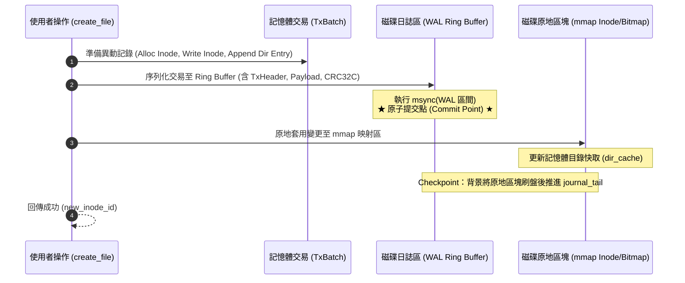

# OIFS Metadata WAL (Write-Ahead Logging / Journaling) 規格設計書

本文件定義 **OIFS (O's Inode File System)** 的 **Metadata WAL (Write-Ahead Logging / 日誌子系統)** 架構規範、日誌格式、磁碟佈局、崩潰復原機制與形式化驗證設計。

---

## 1. 背景與痛點 (Problem Statement)

目前 OIFS 在執行多項元數據異動時（例如 `create_file`、`delete_file`、`mkdir`），需要相繼修改多個互不相鄰的磁碟區塊：
1. **Inode Bitmap** 標記已分配/釋放
2. **Data Block Bitmap** 標記資料區塊已分配/釋放
3. **Inode Table** 寫入或更新 Inode 結構（256 位元組）
4. **目錄資料區塊** 追加或移除 `DirectoryEntry`
5. **父目錄 Inode** 更新檔案大小與 `modified_at` 時間戳記

### 當前風險
若在上述連續寫入的途中遭遇 **斷電、行程 SIGKILL 崩潰或主機重開機**：
* 容易產生孤立 Inode (Orphan Inodes)、洩漏區塊 (Leaked Blocks) 或目錄項指向無效 Inode 的情況。
* 目前系統必須仰賴全盤掃描的 `oifs fsck` 來重新走訪所有 Inode 與區塊進行修復，對於大型映像檔耗時較長。

### 目標 (Goals)
* **可選功能 (Opt-in / Optional Feature)**：支援使用者在建立映像檔時自由選擇是否啟用日誌（`--journal`）。未啟用時維持極致輕量與零額外磁碟開銷。
* **原子事務 (Atomic Transactions)**：啟用日誌時，確保一組元數據修改具備「All-or-Nothing」原子性。
* **毫秒級復原 (Fast Crash Recovery)**：開機載入時透過循序重放日誌（Redo Replay），於 **< 5ms** 內自動修復未完成事務，無需全盤 `fsck`。
* **零拷貝與 4KB 對齊不受影響**：WAL 僅記錄 Metadata 操作，不干擾資料區塊的 4096-byte 頁面對齊與零拷貝讀寫。
* **100% 向下相容性**：既有舊版映像檔或未啟用日誌的檔案系統可無縫掛載與運作，讀寫路徑零額外負擔。

---

## 2. 可選架構設計與向下相容 (Optional Architecture & Compatibility)

WAL 機制被設計為**完全可選的模組化外掛（Opt-in Feature）**，類似 Linux ext2（無日誌）與 ext3/ext4（有日誌 JBD2）的關係：

### 2.1 CLI 建立介面
* **啟用日誌（預設推薦用於需要高可靠性的環境）**：
  ```bash
  cargo run --bin oifs -- -i disk.img create --size 10 --journal
  ```
* **停用日誌（純極限記憶體吞吐量或極小尺寸映像檔）**：
  ```bash
  cargo run --bin oifs -- -i disk.img create --size 10 --no-journal
  ```

### 2.2 磁碟佈局雙模對比

#### 模式 A：停用日誌（Legacy / No-Journal，與目前 OIFS 100% 相同）
```text
[Block 0] SuperBlock (has_journal = false, journal_block_count = 0)
[Block 1] Inode Bitmap
[Block 2] Data Bitmap
[Block 3 .. 1026] Inode Table (1024 區塊)
[Block 1027 ..] Data Blocks (實際資料)
```
* 特色：無任何空間浪費，讀寫行為與既有程式碼完全一致。

#### 模式 B：啟用日誌（Journaled）
```text
[Block 0] SuperBlock (has_journal = true, journal_block_count = 32)
[Block 1] Inode Bitmap
[Block 2] Data Bitmap
[Block 3 .. 34] Journal Ring Buffer (32 個區塊 = 128 KB)
[Block 35 .. 1058] Inode Table (1024 區塊)
[Block 1059 ..] Data Blocks (實際資料)
```

### 2.3 執行期雙軌分支（Zero-Overhead Dispatch）
在 `DiskManager` 的寫入關鍵路徑中，依據 `guard.has_journal()` 決定策略：
```rust
if guard.has_journal() {
    // 啟用模式：先寫入 WAL 交易 -> msync WAL -> 套用至記憶體 -> 背景 Checkpoint
    Self::execute_metadata_transaction(&mut guard, tx)?;
} else {
    // 停用模式：維持現有原地更新與 sync_mutation_ranges (零額外開銷)
    Self::execute_legacy_in_place(&mut guard, mutation)?;
}
```

---

## 3. 磁碟佈局與結構 (Disk Layout)

WAL 日誌區塊採用**專屬固定大小環狀緩衝區 (Circular Ring Buffer)** 結構：

```text
+---------------+-------------------+------------------+-----------------------+---------------------+-------------------+
| Block 0       | Block 1           | Block 2          | Block 3 .. 34         | Block 35 .. 1058    | Block 1059 ..     |
| SuperBlock    | Inode Bitmap      | Data Bitmap      | Journal Ring Buffer   | Inode Table         | Data Blocks       |
| (含 WAL 參數) | (1 block = 32K)   | (1 block = 32K)  | (32 blocks = 128KB)   | (1024 blocks)       | (實際檔案/目錄)   |
+---------------+-------------------+------------------+-----------------------+---------------------+-------------------+
```

### 2.1 SuperBlock 欄位擴充
在 [`src/superblock.rs`](file:///Users/ych/oifs/src/superblock.rs) 的 `SuperBlock` 結構中擴充以下欄位（利用 Block 0 剩餘空間，保持向下相容）：

```rust
pub struct SuperBlock {
    // ... 既有欄位 (magic, block_size, block_count 等) ...

    // --- Metadata WAL 擴充欄位 ---
    /// 是否啟用 WAL 日誌功能
    pub has_journal: bool,
    /// 日誌區塊起始 Block ID (例如 3)
    pub journal_start_block: u64,
    /// 日誌區塊總數 (例如 32，共 128 KB)
    pub journal_block_count: u32,
    /// 日誌寫入指標 (Head Byte Offset 於日誌環狀區內)
    pub journal_head: u64,
    /// 日誌 Checkpoint 推進指標 (Tail Byte Offset)
    pub journal_tail: u64,
    /// 單調遞增交易 Sequence ID
    pub journal_tx_seq: u64,
    /// 乾淨卸載標記 (Cleanly Unmounted Flag)
    pub cleanly_unmounted: bool,
}
```

---

## 3. 日誌交易與記錄格式 (WAL Record & Transaction Format)

每個事務由一個固定大小的標頭（Header）、多個原子操作記錄（Operations）及結尾標記組成，並以硬體加速的 **CRC32C** 校驗整筆交易，防止撕裂寫入（Torn Write）。

### 3.1 交易結構 (Transaction Frame)

```text
+-----------------------------------------------------------------------------------+
| TxHeader (24 Bytes)                                                               |
|  - magic: u32 = 0x57414C54 ("WALT")                                              |
|  - tx_seq: u64 (遞增事務編號)                                                      |
|  - payload_len: u32 (Records 資料總長度)                                          |
|  - crc32c: u32 (涵蓋整個 Header 與 Payload 的校驗碼)                              |
|  - reserved: u32                                                                  |
+-----------------------------------------------------------------------------------+
| Payload: 一連串緊湊序列化的 MetadataOp Records                                    |
|  - Op 1: SetInodeBitmap { inode_id, allocated }                                   |
|  - Op 2: WriteInode { inode_id, inode_data }                                      |
|  - Op 3: MutateDirectoryBlock { block_id, offset, bytes }                         |
|  - Op 4: UpdateInode { inode_id, size, mtime }                                    |
+-----------------------------------------------------------------------------------+
| TxCommitMarker: u32 = 0xDEADBEEF                                                  |
+-----------------------------------------------------------------------------------+
```

### 3.2 操作類型定義 (MetadataOp)

```rust
#[derive(Debug, Clone, Serialize, Deserialize, PartialEq)]
pub enum MetadataOp {
    /// Inode Bitmap 分配或釋放
    SetInodeBitmap {
        inode_id: u64,
        allocated: bool,
    },
    /// Data Block Bitmap 分配或釋放
    SetDataBitmap {
        block_id: u64,
        allocated: bool,
    },
    /// Inode 寫入或原地屬性更新
    WriteInode {
        inode_id: u64,
        inode_bytes: [u8; 256],
    },
    /// 目錄資料區塊的局部寫入 (新增/刪除 entry)
    WriteDirectorySlice {
        block_id: u64,
        offset: u16,
        data: Vec<u8>,
    },
}
```

---

## 4. 寫入管線生命週期 (Write Pipeline & Lifecycle)

以建立檔案 `create_file(parent_id, "example.txt")` 為例，變更流程重構為 4 個標準階段：



### 關鍵原子保證
1. **斷電發生在步驟 2 之前**：WAL 無此記錄，主資料未被修改，狀態保持原子乾淨。
2. **斷電發生在步驟 2 之中（Torn Write）**：CRC32C 校驗失敗，開機時直接捨棄該筆無效交易，狀態等同未發生。
3. **斷電發生在步驟 3 途中（原地修改做到一半）**：WAL 已經具有完整的 CRC32C，開機復原時重新套用（Redo），自動修補未完成的 Inode 或 Bitmap。

---

## 5. 崩潰復原機制 (Crash Recovery & Redo Replay)

在 `DiskManager::open` 初始化階段，若偵測到 `cleanly_unmounted == false` 或 `journal_head != journal_tail`：

```rust
pub fn recover_from_journal(mmap: &mut MmapMut, sb: &mut SuperBlock) -> Result<usize, DiskManagerError> {
    let mut cursor = sb.journal_tail;
    let mut replayed_transactions = 0;
    let ring_size = sb.journal_block_count as u64 * sb.block_size as u64;

    while cursor != sb.journal_head {
        match read_tx_frame(mmap, sb, cursor) {
            Ok(tx) if tx.verify_crc() => {
                // CRC 吻合：交易有效，重放所有操作
                for op in tx.ops {
                    apply_op_in_place(mmap, sb, &op)?;
                }
                cursor = (cursor + tx.total_len()) % ring_size;
                replayed_transactions += 1;
            }
            _ => {
                // 遇到損毀、不完整或未提交交易：終止重放
                break;
            }
        }
    }

    // 將所有套用變更同步回磁碟，重置日誌指標
    mmap.flush()?;
    sb.journal_tail = cursor;
    sb.journal_head = cursor;
    sb.cleanly_unmounted = true;
    sync_superblock(mmap, sb)?;

    Ok(replayed_transactions)
}
```

---

## 6. 與現有特性的協同設計

1. **DurabilityMode 取捨**：
   - `DurabilityMode::Strict`：每次交易寫入 WAL 後皆同步 `msync` WAL 區段（零遺失保證）。
   - `DurabilityMode::Lazy` / `RangeAsync`：記憶體中批次緩衝日誌，依週期性 Timer 或明確 `sync()` 時落盤（兼顧極限吞吐量）。
2. **Master-Proxy IPC**：
   - 僅由 Master 行程負責寫入 WAL 與推進指標，Proxy 行程透過 UDS/TCP 發送請求，無跨行程日誌鎖爭用問題。
3. **形式化驗證 (Kani Proofs)**：
   - 證明 `apply_op_in_place` 具備**嚴格冪等性**（重複執行兩次結果完全相同）。
   - 證明環狀指標偏移計算 `(cursor + len) % ring_size` 絕不發生整數溢位或越界。

---

## 7. 推進里程碑 (Roadmap)

| 階段 | 項目 | 目標 | 狀態 |
| :--- | :--- | :--- | :--- |
| **M1** | 格式與日誌模組 (`src/journal.rs`) | 實作 `MetadataOp` 序列化、TxHeader 與 CRC32C 計算 | ✅ **完成** |
| **M2** | Superblock 擴充與佈局更新 | 支援建立帶有日誌區塊的映像檔，並保持向下相容解析 | ✅ **完成** |
| **M3** | 寫入路徑重構 (`src/disk.rs`) | 將 `create_file`、`delete_file`、`mkdir` 納入日誌交易 | ⏳ **未開始** |
| **M4** | 崩潰復原與壓力測試 | 模擬斷電崩潰（Kill process / Torn-write injection）驗證自動自癒 | 🟡 **部分完成** |
| **M5** | Kani 形式化證明 | 加入 CBMC 形式化數學驗證，證明重放安全性與環狀緩衝不變量 | 🟡 **部分完成** |

---

## 8. 實作成果 (Implementation Status)

### 8.1 已完成：M1 格式與日誌模組 (`src/journal.rs`)

* **CRC32C (Castagnoli)**：以 `const fn` 產生 256 項查找表，不依賴 `crc32c` crate，因此可在 Kani/CBMC 下驗證；輸出符合標準檢查值 `0xE3069283`。
* **交易框架**：`magic(4) tx_seq(8) payload_len(4) crc32c(4) payload commit(4)`。CRC 明確涵蓋 `tx_seq || payload_len || payload`（即撕裂寫入可能破壞的區域），編碼器與解碼器共用同一個 `crc_input()` 函式以杜絕兩端不一致。
* **`MetadataOp` 四種冪等操作**：`SetInodeBitmap`、`SetDataBitmap`、`WriteInode`、`WriteBlockSlice`。全部為「絕對後映像寫入」，不使用增量或相對位移，因此**重放任意次數與重放一次等價**。
* **`JournalRing` 環狀緩衝**：1 個標頭區塊 + 32 個記錄區塊（128 KB）。框架永不被環狀邊界切開；容量不足時推進 tail（覆蓋最舊交易），此舉安全之處正在於重放的冪等性。
* **`recover()`**：自 tail 走訪至 head，逐筆驗證 CRC 與 commit marker，遇損毀框架即停止（其前皆為有效資料），並回傳重放筆數。

### 8.2 已完成：M2 佈局與向下相容

* **完全不修改 `SuperBlock` 結構體**。日誌參數改以一個自帶 magic 的標頭區塊存放在 Block 3，其餘欄位的 bincode 位元組序列與舊版**完全一致**。
* `SuperBlock::new_with_layout(total_blocks, inode_table_block)` 抽出共用公式；`new()` 等同 `new_with_layout(nb, 3)`（已由 Kani 證明兩者結���相等），因此**未啟用日誌的映像檔佈局與舊版逐位元組相同**。
* `SuperBlock::new_journaled()` 將 inode table 置於 `3 + 33 = 36`，`has_journal_layout()` 即以此幾何條件偵測。
* **CLI**：`oifs -i disk.img create --size 10 --journal`。
* **自動復原**：日誌於掛載時、在 manager 對外發布「之前」完成重放，因此呼叫者不可能觀察到半復原的檔案系統。Proxy 行程不需傳遞任何旗標。

### 8.3 已驗證

* **單元測試 12 項**（`src/journal.rs`）：CRC 向量、狀態往返、op 編解碼往返、框架往返、**逐一翻轉每個位元驗證皆被 CRC 拒絕**、環狀回捲不切開框架、`recover` 於撕裂框架處停止、`apply_op_in_place` **冪等性**。
* **整合測試 11 項**（`tests/journal_test.rs`）：建立/重開/CRUD 往返、舊版映像檔不受影響、Block 3 標頭驗證、**崩潰復原重放**（寫入 durable tx 但不套用，掛載後驗證 bit 已設置）、**撕裂交易被捨棄且檔案系統仍可用**、redo 冪等性。
* **Kani 證明 53 項全數通過**（新增 3 項）：`proof_legacy_layout_unchanged`、`proof_journaled_layout_non_overlapping`、`proof_journaled_shifts_data_start`。
* 全數 45 個測試套件、clippy（`-D warnings`）、fmt 皆通過，無回歸。

### 8.4 尚未完成：M3 寫入路徑整合

目前日誌基礎設施與復原機制已就緒，但 `create_file` / `delete_file` / `mkdir` **尚未寫入交易**。這是接下來的核心工作，設計約束如下：

1. **必須 WAL-first**：需先算出各區塊的「後映像」再落盤 WAL，最後才套用。這要求重構 `create_entry_internal` 與 `delete_file`，把「計算」與「套用」拆開——因為現有函式是邊算邊改。
2. **可行切入點**：`delete_file` 的後映像皆可在不修改 mmap 的前提下算出（剩餘 entries 序列化、父 inode mtime、要釋放的區塊清單），最適合作為第一個接入點。
3. **零開銷保證**：未啟用日誌時必須完全走既有路徑，以 `guard.superblock.has_journal_layout()` 分流。
