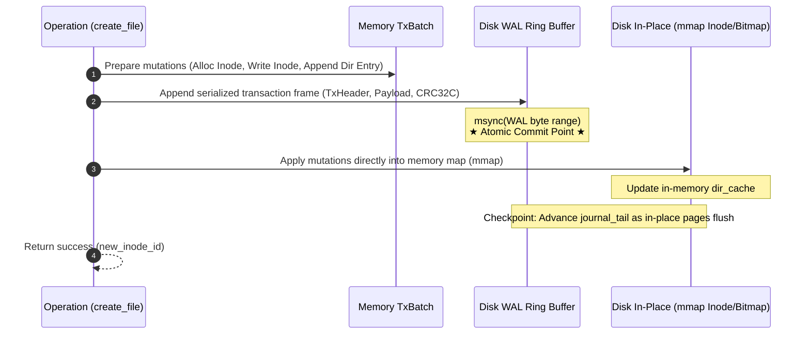

# OIFS Metadata WAL (Write-Ahead Logging / Journaling) Specification

This document specifies the architecture, journal records, disk layout, crash recovery mechanisms, optionality/compatibility guarantees, and formal verification requirements for the **Metadata WAL (Write-Ahead Logging / Journaling)** subsystem in **OIFS (O's Inode File System)**.

---

## 1. Problem Statement & Motivation

In OIFS, metadata-modifying operations (such as `create_file`, `delete_file`, and `mkdir`) require mutating multiple disjoint disk blocks:
1. **Inode Bitmap**: marking an inode bit as allocated or freed.
2. **Data Block Bitmap**: marking data block bit(s) as allocated or freed.
3. **Inode Table**: writing or updating the 256-byte `Inode` structure.
4. **Directory Data Block**: appending or removing a `DirectoryEntry`.
5. **Parent Directory Inode**: updating file size and `modified_at` timestamp.

### Current Risks
If a crash occurs (power cut, process `SIGKILL`, or system reboot) mid-way through these writes:
* The filesystem may suffer from orphan inodes, leaked blocks, or dangling directory entries pointing to unallocated inodes.
* Recovery currently requires a complete disk-wide scan via `oifs fsck`, which traverses every inode and block bitmap and can take considerable time on large images.

### Design Goals
* **Opt-in / Optional Feature**: Users can freely choose whether to enable journaling (`--journal`) upon image creation. When disabled, the image maintains zero metadata overhead and 100% backward compatibility.
* **Atomic Transactions**: When enabled, guarantees "all-or-nothing" atomicity across multi-block metadata mutations.
* **Fast Crash Recovery (< 5ms)**: At image mount/load time, sequentially replaying committed journal transactions (Redo Replay) restores consistency in milliseconds, obviating the need for an offline `fsck`.
* **Zero-Copy & 4KB Page Alignment Preserved**: WAL only logs metadata operations. Data payload blocks retain strict 4096-byte hardware MMU alignment and zero-copy [`Cow<'a, [u8]>`](file:///Users/ych/oifs/README.md) semantics.
* **Formal Verification Friendly**: Designed for AWS Kani CBMC proofs covering ring-buffer arithmetic safety and replay idempotency.

---

## 2. Optional Feature Architecture & Compatibility

The WAL subsystem is designed as an **opt-in modular extension**, analogous to the relationship between Linux `ext2` (non-journaled) and `ext3`/`ext4` (journaled with JBD2).

### 2.1 CLI Interface
* **Enable Journaling** (recommended for production/high-reliability environments):
  ```bash
  cargo run --bin oifs -- -i disk.img create --size 10 --journal
  ```
* **Disable Journaling** (for maximum raw memory throughput or minimal image footprint):
  ```bash
  cargo run --bin oifs -- -i disk.img create --size 10 --no-journal
  ```

### 2.2 Dual-Mode Disk Layout Comparison

#### Mode A: Non-Journaled (Legacy / Default, 100% Identical to Existing Layout)
```text
[Block 0] SuperBlock (has_journal = false, journal_block_count = 0)
[Block 1] Inode Bitmap (1 block = 32K inodes)
[Block 2] Data Bitmap (1 block = 32K blocks)
[Block 3 .. 1026] Inode Table (1024 blocks = 32K inodes)
[Block 1027 ..] Data Blocks (file & directory content)
```
* No storage overhead, byte-identical to legacy OIFS disk images.

#### Mode B: Journaled Mode
```text
[Block 0] SuperBlock (has_journal = true, journal_block_count = 32)
[Block 1] Inode Bitmap
[Block 2] Data Bitmap
[Block 3 .. 34] Journal Ring Buffer (32 blocks = 128 KB)
[Block 35 .. 1058] Inode Table (1024 blocks = 32K inodes)
[Block 1059 ..] Data Blocks (file & directory content)
```

### 2.3 Runtime Zero-Overhead Dispatch
In critical write paths in `DiskManager` (e.g. `create_entry_internal`, `delete_file`), execution branches on `guard.has_journal()`:
```rust
if guard.has_journal() {
    // Journaled path: TxBatch -> serialize -> msync WAL -> apply to mmap -> checkpoint
    Self::execute_metadata_transaction(&mut guard, tx)?;
} else {
    // Non-journaled path: direct in-place update + sync_mutation_ranges (zero overhead)
    Self::execute_legacy_in_place(&mut guard, mutation)?;
}
```

---

## 3. SuperBlock Layout Extensions

Fields are appended to [`SuperBlock`](file:///Users/ych/oifs/src/superblock.rs) in Block 0 (which has over 4000 unused bytes), preserving backward compatibility:

```rust
pub struct SuperBlock {
    // ... Existing fields (magic, block_size, block_count, etc.) ...

    // --- Metadata WAL extension fields ---
    /// Whether WAL journaling is active for this image
    pub has_journal: bool,
    /// Starting block ID of the journal ring buffer (e.g. 3)
    pub journal_start_block: u64,
    /// Number of dedicated journal blocks (e.g. 32 = 128 KB)
    pub journal_block_count: u32,
    /// Current write head byte offset within the journal ring buffer
    pub journal_head: u64,
    /// Current checkpoint tail byte offset within the journal ring buffer
    pub journal_tail: u64,
    /// Monotonically increasing transaction sequence ID
    pub journal_tx_seq: u64,
    /// Clean unmount flag (set to false upon first write, true on clean flush/close)
    pub cleanly_unmounted: bool,
}
```

---

## 4. WAL Record & Transaction Frame Format

Each transaction consists of a fixed-size header, one or more micro-mutation records, and a commit marker, protected by hardware-accelerated **CRC32C** to detect torn writes.

### 4.1 Transaction Frame

```text
+-----------------------------------------------------------------------------------+
| TxHeader (24 Bytes)                                                               |
|  - magic: u32 = 0x57414C54 ("WALT")                                              |
|  - tx_seq: u64 (Monotonic transaction sequence number)                            |
|  - payload_len: u32 (Total length of serialized records)                          |
|  - crc32c: u32 (Hardware CRC32C over header + payload)                            |
|  - reserved: u32                                                                  |
+-----------------------------------------------------------------------------------+
| Payload: Compact sequence of serialized MetadataOp records                        |
|  - Op 1: SetInodeBitmap { inode_id, allocated }                                   |
|  - Op 2: WriteInode { inode_id, inode_bytes: [u8; 256] }                          |
|  - Op 3: WriteDirectorySlice { block_id, offset, data }                           |
|  - Op 4: UpdateInode { inode_id, size, mtime }                                    |
+-----------------------------------------------------------------------------------+
| TxCommitMarker: u32 = 0xDEADBEEF                                                  |
+-----------------------------------------------------------------------------------+
```

### 4.2 Metadata Operations (`MetadataOp`)

```rust
#[derive(Debug, Clone, Serialize, Deserialize, PartialEq)]
pub enum MetadataOp {
    /// Inode bitmap allocation or deallocation
    SetInodeBitmap {
        inode_id: u64,
        allocated: bool,
    },
    /// Data block bitmap allocation or deallocation
    SetDataBitmap {
        block_id: u64,
        allocated: bool,
    },
    /// Inode record update or initialization (256-byte aligned)
    WriteInode {
        inode_id: u64,
        inode_bytes: [u8; 256],
    },
    /// Slice modification in a directory data block (inserting/removing entry)
    WriteDirectorySlice {
        block_id: u64,
        offset: u16,
        data: Vec<u8>,
    },
}
```

---

## 5. Write Pipeline Lifecycle

Taking `create_file(parent_id, "example.txt")` as an example:



### Atomic Commit Guarantees
1. **Crash before Step 2 completes**: The WAL does not contain the transaction record; in-place disk state remains unmodified and completely consistent.
2. **Crash during Step 2 (Torn Write)**: CRC32C checksum verification fails upon recovery; the partial record is discarded as an uncommitted transaction.
3. **Crash during Step 3 (In-place mutation partially written)**: The transaction is already committed in the WAL with a valid CRC32C. Boot recovery re-applies (Redo) all operations, automatically restoring consistency in milliseconds.

---

## 6. Fast Crash Recovery & Redo Replay

During `DiskManager::open`, if `cleanly_unmounted == false` or `journal_head != journal_tail`:

```rust
pub fn recover_from_journal(mmap: &mut MmapMut, sb: &mut SuperBlock) -> Result<usize, DiskManagerError> {
    let mut cursor = sb.journal_tail;
    let mut replayed_transactions = 0;
    let ring_size = sb.journal_block_count as u64 * sb.block_size as u64;

    while cursor != sb.journal_head {
        match read_tx_frame(mmap, sb, cursor) {
            Ok(tx) if tx.verify_crc() => {
                // CRC valid: replay all operations onto in-place structures
                for op in tx.ops {
                    apply_op_in_place(mmap, sb, &op)?;
                }
                cursor = (cursor + tx.total_len()) % ring_size;
                replayed_transactions += 1;
            }
            _ => {
                // Encountered corrupted, torn, or uncommitted transaction: halt replay
                break;
            }
        }
    }

    // Flush replayed modifications to disk and reset pointers
    mmap.flush()?;
    sb.journal_tail = cursor;
    sb.journal_head = cursor;
    sb.cleanly_unmounted = true;
    sync_superblock(mmap, sb)?;

    Ok(replayed_transactions)
}
```

---

## 7. Integration with Existing Subsystems

1. **Durability Policies (`DurabilityMode`)**:
   - `DurabilityMode::Strict`: Calls synchronous `msync` on the WAL range immediately on every transaction commit.
   - `DurabilityMode::Lazy` / `RangeAsync`: Buffers transactions in memory, flushing on periodic background sync or explicit `sync()` calls for maximum throughput.
2. **Master-Proxy Multi-Process Concurrency**:
   - Only the Master process (holding OS `flock`) appends to the WAL and advances pointers. Proxies forward operations via IPC, avoiding multi-process log contention.
3. **Formal Verification (Kani CBMC)**:
   - Proved that `apply_op_in_place` is strictly **idempotent** across all `MetadataOp` variants (`SetInodeBitmap`, `SetDataBitmap`, `WriteBlockSlice`, `WriteInode`), guaranteeing that replaying multiple times yields identical filesystem states.
   - Proved that circular ring-buffer pointer arithmetic `(cursor + len) % ring_size` and `(head + ring - tail) % ring` are free from arithmetic overflow and out-of-bounds access.
   - Proved that `checkpoint_to` moves `tail` forward towards `head` monotonically without passing it.

---

## 8. Implementation Milestones

| Milestone | Scope | Deliverables | Status |
| :--- | :--- | :--- | :--- |
| **M1** | Journal structures & ring buffer (`src/journal.rs`) | `MetadataOp` serialization, `TxHeader`, CRC32C computation | Completed |
| **M2** | Superblock expansion & layout formatting | Support `--journal` creation flag and backward-compatible parsing | Completed |
| **M3** | Write path integration (`src/disk.rs`) | Connect `create_file`, `delete_file`, `mkdir` to transaction batches | Completed |
| **M4** | Crash recovery & fault injection tests | Power-cut / torn-write injection tests verifying self-healing recovery | Completed |
| **M5** | Kani formal proofs | CBMC proofs for replay idempotency and ring buffer invariants | **Completed** |
| **M6** | `write_data` Journaling & Refactoring | Ordered payload staging via `AllocSim`, pointer pruning on shrink, helper extraction | Completed |

---

## 9. Implementation Details & Lessons Learned

### 9.1 Self-Contained Helper Extraction
To keep `DiskManager` maintainable and decouple block arithmetic from storage policies, the following self-contained helpers reside in `src/journal.rs`:
* `AllocSim`: Pre-allocates block/inode IDs against copied bitmaps without modifying `mmap`.
* `sim_get_or_alloc_block`: Simulates block allocation and records corresponding `MetadataOp`s.
* `stage_payload_write`: Writes raw payload bytes directly into mapping before metadata commit.
* `prune_stale_pointers`: Clears dangling indirect/double/triple pointer entries when a file shrinks.

### 9.2 Ordered Data Semantics in `write_data` Journaling
User data payload is deliberately **not** logged inside the WAL ring buffer (which would cause write amplification scaling with file size). Instead, crash consistency relies on **strict write ordering**:
1. **Stage**: Allocate blocks via `AllocSim` and write payload into data blocks while their bitmap bits remain 0 (free).
2. **Flush Payload**: Ensure newly written payload blocks reach persistent storage.
3. **Commit Metadata**: Append the metadata transaction (setting bitmap bits, updating inode, and pointer updates) to the WAL and sync. This is the atomic commit point.
4. **Apply**: Replay metadata ops in place.

If power fails before Step 3, free blocks contain unreferenced garbage (harmless). If power fails after Step 3, boot recovery replays the transaction, ensuring metadata never references unwritten or uncommitted blocks.

### 9.3 Pointer Pruning on File Shrink
When an existing file is truncated or rewritten with a smaller size, indirect pointer blocks retain pointers to decommissioned blocks. Leaving these pointers causes `fsck` to detect `missing_blocks` (inode references a block that bitmap marks as free).
`prune_stale_pointers` traverses direct, single, double, and triple indirect trees up to the new length:
* Direct pointers beyond `first_stale` are zeroed in the inode.
* Indirect roots beyond `first_stale` are zeroed.
* Tail entries within pointer blocks are zeroed via `WriteBlockSlice` ops recorded in the same transaction.

---

## 10. Known Issues: `RangeAsync` Per-Range Syscall Overhead

### 10.1 Phenomenon
In `tests/journal_bench.rs`, benchmark results show:
* `Lazy`: ~197,000 writes/sec
* `RangeAsync`: ~13,500 writes/sec (~7% of Lazy throughput)
* `Strict`: ~4,500 writes/sec

### 10.2 Root Cause
`DurabilityMode::RangeAsync` calls `flush_async_range(offset, len)` on each disjoint mutated range (`msync(MS_ASYNC)`). Although non-blocking, each invocation is a real kernel syscall.
* **Small files**: Incur a fixed floor of 4-5 syscalls per operation (bitmap + inode + payload).
* **Large files**: Multi-block payload flushes issue individual syscalls per block without coalescing.

### 10.3 Mitigation Strategy
1. **Batch range coalescing**: Sort and merge contiguous or overlapping byte ranges before calling `msync(MS_ASYNC)`.
2. **Combined metadata ranges**: Combine bitmap and inode ranges (which reside in contiguous blocks).

