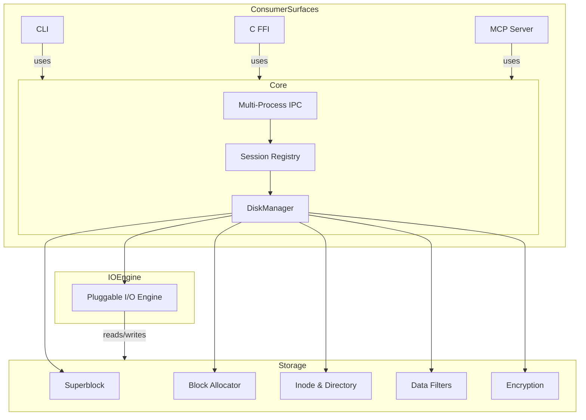

# OIFS Architecture Overview

OIFS (O's Inode File System) is a Rust-based inode filesystem that packages an entire hierarchical filesystem into a single portable `.img` container file. It combines traditional Unix-like semantics with advanced features for large-scale data management, security, and extensibility.

## Core Design Principles

- **Single-Image Container**: All filesystem metadata (superblock, inodes, directories, bitmaps) and file data are stored contiguously in one host file, memory-mapped for efficient access.
- **Block-Oriented Layout**: Fixed 4KB block size with extent-based indexing (direct, single/double/triple indirect) supports files up to 513GB.
- **Pluggable I/O Engine**: Decouples block access from memory mapping via configurable backends (`mmap`, `pread`, Linux `io_uring`).
- **Multi-Process Concurrency**: Dynamic Master-Proxy architecture coordinates shared access via IPC (Unix domain sockets or TCP).
- **Layered Security**: Transparent at-rest encryption (XChaCha20-Poly1305 AEAD) with Argon2id key derivation and deterministic filename privacy.
- **Consumer Surfaces**: Unified access through CLI, C FFI library, and MCP server for AI agent integration.

## Module Layout

The core library (`src/lib.rs`) organizes functionality into 12 specialized modules:

* **allocator** (`src/allocator.rs`): Sequential hint-based block and inode allocator.
* **bitmap** (`src/bitmap.rs`): Hardware-accelerated free-block scanning via `tzcnt`.
* **directory** (`src/directory.rs`): Variable-length entries with memory-indexed lookups (`DirIndex`).
* **disk** (`src/disk.rs`): Central `DiskManager` handling mmap lifecycle, concurrency (`RwLock`), durability, and defragmentation.
* **encryption** (`src/encryption.rs`): XChaCha20-Poly1305 AEAD, Argon2id KDF, SIV filename encryption.
* **ffi** (`src/ffi.rs`): C ABI surface with `OIFSHandle`, backend selection, and thread-isolated errors.
* **filters** (`src/filters.rs`): Pre-compression transformations (Delta, ByteShuffle, BitShuffle, TruncPrecision) and pipeline optimization.
* **inode** (`src/inode.rs`): 256-byte inode structure, block pointers, and formal verification via Kani.
* **io_engine** (`src/io_engine.rs`): Pluggle I/O backends with ExtentList coalescing and kernel gating.
* **ipc** (`src/ipc.rs`): Master-Proxy protocol, UDS/TCP rendezvous, length-prefixed framing.
* **session** (`src/session.rs`): Process-wide session registry with reference counting and failover.
* **superblock** (`src/superblock.rs`): On-disk superblock magic (`OIFS`), geometry, and compatibility.

## Consumer Surfaces

OIFS exposes three distinct access paths to the same underlying library:

1. **Command Line Interface** (`src/bin/oifs.rs`): Full-featured CLI for filesystem creation, manipulation, inspection, and maintenance.
2. **C Foreign Function Interface** (`src/ffi.rs`): Stable C API (`liboifs.so/dylib`) enabling integration with C/C++ applications.
3. **Model Context Protocol Server** (`src/bin/oifs_mcp.rs`): JSON-RPC server allowing AI agents and IDEs to inspect and modify OIFS images via standardized tools.

The MCP server and its async dependencies (`tokio`, `rmcp`) are gated behind the optional `mcp` feature flag, permitting lightweight builds without async runtimes.

## Key Features

* **Inode-Based Architecture**: Traditional Unix metadata model supporting files, directories, hard links, and timestamps.
<!-- openwiki: broken internal link [src/lib.rs#L20] file "src/lib.rs" does not exist. Fix the href or restore the target, then delete this comment. -->
* **Large File Support**: 513GB maximum file size via triple-indirect block indexing ([`BLOCK_SIZE = 4096`](src/lib.rs#L20)).
* **Authenticated Encryption**: XChaCha20-Poly1305 AEAD with per-file nonces, Argon2id key derivation, and synthetic IV filename privacy.
* **Online Defragmentation**: Atomic 3-step replacement preserving metadata, compression, and encryption during live operation.
* **Pluggable I/O Engine**: Runtime-selectable backends (`mmap` for simplicity, `pread` for compatibility, `io_uring` for high-performance async I/O on Linux).
* **Extreme Compression**: Blosc2-style pre-processing filters (Delta, ByteShuffle, BitShuffle, TruncPrecision) combined with Zstandard for up to 390x compression ratios on numerical data.
* **Multi-Process Safety**: Master-Proxy arbitration via `flock`, disjoint byte-range merging, and POSIX `pwrite` semantics for overlapping writes.
* **Zero-Allocation Optimizations**: Hardware-accelerated bitmap scanning, zero-copy directory lookups, and filter pipelines using `Cow<'a, [u8]>`.
* **Formal Verification**: 50+ Kani proofs across modules ensuring memory safety, arithmetic correctness, and filesystem invariants.
* **Rigorous Concurrency Testing**: Shuttle randomized thread-schedule permutations and ThreadSanitizer stress tests.

## On-Disk Format

The `.img` container begins with a 512-byte superblock, followed by:
- Allocation bitmaps (inode and data blocks)
- Inode table (fixed-size 256-byte entries)
- Directory hierarchies (variable-length entries)
- Data blocks (compressed and/or encrypted as specified by inode attributes)

All multi-byte integers are stored in little-endian byte order. The format is backward-compatible; new feature flags are tolerated by older versions.

## Related Topics

* [Block Allocation](./block_allocation.md)
* [Compression and Filters](./compression_and_filters.md)
* [Concurrency and Session](./concurrency_and_session.md)
* [Disk Manager and Persistence](./disk_manager_and_persistence.md)
* [Encryption](./encryption.md)
* [FFI Interface](./ffi_interface.md)
* [Inode and Directory](./inode_and_directory.md)
* [MCP Server](./mcp_server.md)
* [Superblock and Layout](./superblock_and_layout.md)
* [Configuration](../concepts/configuration.md)
* [FFI Integration](../integrations/ffi_integration.md)
* [MCP Integration](../integrations/mcp_integration.md)
* [CLI Reference](../operations/cli_reference.md)
* [Basic Operations](../workflows/basic_operations.md)
